# Forge — Roadmap e próximas etapas

Este documento consolida o plano de evolução do Forge com base no estado atual do projeto (POC funcional: FastAPI, Node.js, React estático, Postgres integrado, `forge deploy --migrate` para Node/Prisma). O objetivo é **estabilizar o núcleo**, **preparar deploy seguro em VPS**, **expandir frameworks** e, por fim, **melhorar a experiência de desenvolvimento local** alinhada ao que roda em produção.

**Escopo atual do produto (o que o Forge se propõe hoje):**

- Um app por deploy (`forge.json` + `forge deploy`)
- Builder em container com Docker socket (`make builder-up`)
- Frameworks implementados no servidor: `fastapi`, `nodejs`, `react`
- Postgres opcional por app (`database: true` ou objeto com `variable` / `migration`)
- Checks locais antes do upload (`checks` no manifesto)
- Back e front em **deploys separados** (esperado; integração por proxy/domínio fica a cargo do operador ou de fases futuras)

---

## Visão geral das fases


| Fase  | Nome                                | Foco                                                                             |
| ----- | ----------------------------------- | -------------------------------------------------------------------------------- |
| **1** | Estabilização do núcleo             | Confiabilidade do que já existe; migrations; testes; alinhar manifesto ↔ builder |
| **2** | Preparação para VPS                 | Infra, segurança, operação, smoke em ambiente real; runbook                      |
| **3** | Expansão de frameworks              | Next.js, Django, Flask; experiência mais completa por stack                      |
| **4** | Desenvolvimento local (`forge dev`) | Orquestração local espelhando produção; DX; multi-app no laptop                  |

```mermaid
flowchart LR
  subgraph fase1 [Fase 1 Estabilização]
    A1[Testes e exemplos]
    A2[Migrations Python]
    A3[Templates e manifesto]
  end

  subgraph fase2 [Fase 2 VPS]
    B1[Proxy e TLS]
    B2[Runbook e backup]
    B3[Smoke produção]
  end

  subgraph fase3 [Fase 3 Features]
    C1[Next.js]
    C2[Django e Flask]
    C3[Roteamento e DX]
  end

  subgraph fase4 [Fase 4 Dev local]
    D1[forge dev]
    D2[Postgres dev unificado]
    D3[Proxy e multi-app local]
  end

  fase1 --> fase2 --> fase3 --> fase4
```





---

## Fase 1 — Estabilização do núcleo

Objetivo: tornar **previsível** o deploy de apps FastAPI, Node.js e React (Vite) com Postgres Forge, sem expandir ainda a superfície de frameworks.

### 1.1 Migrations além do Prisma (Node)

O campo `database.migration` já é um **comando shell arbitrário**. O que falta é **validação e exemplos**, não suporte por ORM.


| Entrega                          | Descrição                                                                                                                           |
| -------------------------------- | ----------------------------------------------------------------------------------------------------------------------------------- |
| Exemplo ou doc Alembic (FastAPI) | `migration`: `pip install -r requirements.txt && alembic upgrade head` com `forge deploy --migrate`                                 |
| Runner Python em container       | Executar migrations FastAPI num `python:3.12-slim` na `forge-net` (mesmo modelo do Node), em vez de shell só no processo do builder |
| Smoke Drizzle ou Knex (opcional) | Um exemplo Node com comando `migration` diferente de Prisma, para provar generalização                                              |
| Node sem ORM                     | Exemplo mínimo com `pg` + `DATABASE_URL` (sem `prisma/schema.prisma`)                                                               |


**Critério de aceite:** dois stacks de migration documentados (Prisma + Alembic) passando em CI ou checklist manual com `make builder-up`.

### 1.2 Templates Docker e layouts de projeto


| Área        | Problema atual                                                               | Ação sugerida                                                                                                                   |
| ----------- | ---------------------------------------------------------------------------- | ------------------------------------------------------------------------------------------------------------------------------- |
| **React**   | Template assume saída em `dist/`                                             | Documentar contrato Vite; opcional: detectar `vite.config` / falhar com mensagem clara se `dist/` não existir após build        |
| **Node**    | `npm install` no Dockerfile do app; runtime especial só para Prisma          | Usar `npm ci` quando houver `package-lock.json`; avaliar COPY de `node_modules` de produção do stage build para apps não-Prisma |
| **FastAPI** | Default `uvicorn app.main:app`; `requirements.txt` mínimo gerado em silêncio | Avisar quando `requirements.txt` for auto-gerado; não assumir layout sem validar `start` no manifesto                           |


### 1.3 Manifesto e builder alinhados


| Entrega               | Descrição                                                                                        |
| --------------------- | ------------------------------------------------------------------------------------------------ |
| `script` e `next`     | **Implementar** deploy no builder **ou** remover da validação da CLI até existir suporte         |
| Validação espelhada   | Servidor rejeita os mesmos casos que a CLI (framework + `database` + `--migrate`)                |
| Documentar limitações | React: env de build (`VITE_*`) não vem do Forge no build; DB: só Postgres Forge na stack Compose |


### 1.4 Testes automatizados


| Tipo                              | Escopo                                                                                                              |
| --------------------------------- | ------------------------------------------------------------------------------------------------------------------- |
| Unitários (existentes + novos)    | `database` objeto, `parse_database_config`, manifest, migrations helpers                                            |
| Integração (desejável)            | Job CI com Docker: `docker compose up`, deploy de `fastapi-ping` e `nodejs-notes --migrate`, curl em endpoints      |
| Matriz manual (checklist no repo) | Redeploy, `forge stop`/`start`, dois apps com DB, `forge delete` (drop DB), deploy sem `--migrate` quando há schema |


### 1.5 Ciclo de vida e observabilidade (mínimo)


| Entrega              | Descrição                                                                        |
| -------------------- | -------------------------------------------------------------------------------- |
| Mensagens de erro    | Falhas de migrate/build com stderr legível na resposta do deploy                 |
| Healthcheck opcional | `HEALTHCHECK` nos Dockerfiles gerados ou verificação pós-deploy (futuro próximo) |
| `FORGE_PUBLIC_HOST`  | URL no registry apontando para host/domínio real (útil antes da Fase 2)          |


---

## Fase 2 — Preparação para deploy na VPS

Objetivo: operar o Forge em um servidor Linux com **segurança e rotina**, não apenas “subir o compose”.

### 2.1 Infraestrutura na VPS


| Item          | Ação                                                                                      |
| ------------- | ----------------------------------------------------------------------------------------- |
| Docker Engine | Instalar e manter atualizado; usuário deploy no grupo `docker` ou `DOCKER_GID` no compose |
| Stack Forge   | `make builder-up` com `server/.env` (`FORGE_API_KEY`, `FORGE_POSTGRES_PASSWORD`)          |
| Volumes       | `forge-data` (builder) e `forge-postgres-data` (Postgres); política de backup             |
| Firewall      | Expor só **80/443** (proxy); não publicar `5432` nem faixa `18000–19000` na internet      |
| Recursos      | CPU/RAM/disco para builds simultâneos; monitorar espaço em disco (imagens Docker + dados) |


### 2.2 Segurança e conformidade


| Item           | Referência / ação                                                                                                  |
| -------------- | ------------------------------------------------------------------------------------------------------------------ |
| TLS            | Reverse proxy (Caddy ou Nginx) com certificados Let's Encrypt                                                      |
| API do builder | Acesso só via HTTPS + rede restrita (VPN, IP allowlist ou SSH tunnel)                                              |
| Docker socket  | Consciência de que comprometer o builder ≈ controle do host; ver [SECURITY.md](../SECURITY.md)                     |
| Secrets        | Nunca commitar `server/.env`; rotacionar `FORGE_API_KEY`; metadata em `FORGE_DATA_DIR` contém senhas de DB por app |
| Postgres       | Senha forte do superuser; backup/restauração testados                                                              |


### 2.3 Runbook operacional

Documentar em `docs/VPS.md` (ou seção no README):

1. Provisionar VPS e instalar Docker
2. Clonar repo, configurar `server/.env`
3. `make builder-up` e verificar `forge-postgres` healthy
4. Na máquina de dev: `forge setup --host https://builder.seudominio.com`
5. Proxy: rotas para builder (`/`) e para cada app (subdomínio ou path)
6. Deploy: `forge deploy` / `forge deploy --migrate`
7. Backup diário do volume Postgres
8. Atualização do builder: `git pull`, `make builder-up`, smoke
9. Rollback manual (redeploy de commit anterior; sem rollback automático hoje)

### 2.4 Smoke de produção (checklist)

Executar na VPS (ou staging idêntico) antes de considerar “go live”:

- `forge ping`  
- `fastapi-ping` — GET `/ping` (e `/db-ping` se `database: true`)  
- `nodejs-notes` — `forge deploy --migrate`, POST/GET `/notes`  
- `react-example` — abrir no browser via domínio do proxy  
- Dois apps com DB ao mesmo tempo (`name` diferentes)  
- `forge stop` / `forge start`  
- `forge delete -y` e confirmar remoção de container + DB  
- Redeploy do mesmo app após mudança de código (+ `--migrate` se schema mudou)

### 2.5 Limitações aceitas na VPS (v1)

Registrar explicitamente para evitar surpresas:

- Portas de apps na faixa **18000–19000** (até haver porta fixa ou integração com proxy)  
- `**checks` rodam na máquina do desenvolvedor**, não na VPS  
- Deploy **síncrono** (request HTTP espera build + migrate)  
- Sem rollback automático de imagem  
- Front (React) e API em **URLs diferentes** — CORS e `VITE_*` configurados no projeto  
- Um Postgres compartilhado com **database por app**, não cluster gerenciado externo

---

## Fase 3 — Próximas features relevantes

Objetivo: suportar **stacks completas** com menos atrito, mantendo o modelo “um manifesto por serviço deployável” (back e front continuam podendo ser deploys separados; integração via domínio/proxy).

### 3.1 Next.js (`framework: next`)


| Aspecto               | Desafio                            | Direção                                                         |
| --------------------- | ---------------------------------- | --------------------------------------------------------------- |
| Build                 | `next build` vs export estático    | Suporte a **modo standalone** ou `next start` em container Node |
| Runtime               | SSR, server components, API routes | Dockerfile multi-stage dedicado; porta e `start` no manifesto   |
| Env                   | variáveis em build e runtime       | Convenção `env` / `envFile`; documentar `NEXT_PUBLIC_*`         |
| Database              | apps full-stack Next + Prisma      | Reutilizar `database` + `--migrate`; mesmo runner Node          |
| Integração front+back | App único Next                     | Um deploy; não substitui API FastAPI separada unless monorepo   |


**Entregas sugeridas:** template `templates/next/Dockerfile`, `SUPPORTED_FRAMEWORKS` no servidor, exemplo `examples/next-*`, validação CLI.

**Prioridade:** alta para produtos que já usam Next; **depois** da Fase 1 e smoke Fase 2.

### 3.2 Django (`framework: django`)


| Aspecto      | Direção                                                                              |
| ------------ | ------------------------------------------------------------------------------------ |
| WSGI/ASGI    | `gunicorn` + `uvicorn` workers ou `daphne`; comando `start` no manifesto             |
| Static files | `collectstatic` no build ou migrate step; WhiteNoise ou servir via proxy             |
| Migrations   | `python manage.py migrate` em container Python na `forge-net` (`database.migration`) |
| Settings     | `DATABASE_URL` injetada; `envFile` para `SECRET_KEY`, etc.                           |
| Layout       | Convenção `manage.py` na raiz do projeto                                             |


**Entregas sugeridas:** template Django, exemplo `examples/django-*` com Postgres Forge, documentação de `migration`.

### 3.3 Flask (`framework: flask`)


| Aspecto    | Direção                                                                              |
| ---------- | ------------------------------------------------------------------------------------ |
| Entrypoint | Variável: factory `app:create_app()` ou módulo `wsgi:app`; default documentado       |
| Servidor   | `gunicorn` recomendado em produção (`start` no manifesto)                            |
| Migrations | Alembic ou Flask-Migrate via `database.migration` (runner Python em container)       |
| Estrutura  | Menos opinativo que Django; validar `start` obrigatório se layout não for detectável |


**Entregas sugeridas:** template Flask + exemplo mínimo com DB.

### 3.4 Melhorias transversais (pós-frameworks)


| Feature                                 | Benefício                                                                       |
| --------------------------------------- | ------------------------------------------------------------------------------- |
| **Subdomínio / proxy integrado**        | Campo `subdomain` no `forge.json` gera rota no Caddy (opcional)                 |
| **Porta fixa por app**                  | Previsibilidade no firewall e no proxy                                          |
| **Secrets**                             | Vault ou arquivos fora do registry; não gravar senha de app em metadata legível |
| **Deploy assíncrono**                   | Fila de jobs; CLI polling de status                                             |
| **Monorepo**                            | Um repositório, múltiplos `forge.json` ou manifest multi-service                |
| **Alembic/Django migrate** como presets | Atalhos em `database.migration` além de shell livre                             |


---

## Fase 4 — Desenvolvimento local e DX (`forge dev`)

Objetivo: **espelhar localmente** o que a VPS faz em produção — Postgres, portas, variáveis de ambiente, back + front rodando juntos — sem exigir `forge deploy` a cada alteração. Reduz o gap entre “funciona no meu venv” e “funciona no container na VPS”.

**Por que faz sentido:** hoje o dev roda cada stack à mão (uvicorn, `npm run dev`, Postgres local ou Docker separado, CORS, `VITE_API_URL` ad hoc). O Forge já modela isso no deploy; `forge dev` reutiliza o **mesmo `forge.json`** com um runtime **rápido e orquestrado**.

### 4.1 Comando `forge dev` (MVP)

Comportamento proposto (no diretório do projeto ou de um workspace):

```bash
forge dev              # sobe o app atual conforme forge.json
forge dev --migrate    # aplica migrations antes de subir (local)
forge dev --no-db      # sobe sem Postgres mesmo com database no manifesto
```


| Capacidade               | Descrição                                                                                                                       |
| ------------------------ | ------------------------------------------------------------------------------------------------------------------------------- |
| **Leitura do manifesto** | Mesmo `forge.json` do deploy: `framework`, `start`, `build` (dev), `database`, `envFile`                                        |
| **Modo dev vs prod**     | Campo opcional `dev` no manifesto (ex.: `dev.start`, `dev.port`) ou defaults por framework (`uvicorn --reload`, `npm run dev`)  |
| **Porta local**          | Alocar porta livre (ou fixa em `~/.forge/dev.json`) e imprimir URL; evitar conflito entre vários `forge dev`                    |
| **Sem rebuild Docker**   | Preferir processo nativo (venv / `node_modules` local) ou container **dev** leve (bind-mount do código), não imagem de produção |
| **Paridade com deploy**  | Mesmas env vars que o deploy injetaria (`DATABASE_URL`, `envFile`)                                                              |


**Critério de aceite (MVP):** `forge dev` em `fastapi-ping` e `nodejs-notes` com hot reload; URL estável impressa no terminal.

### 4.2 Postgres dev unificado

Reutilizar o **mesmo modelo** da VPS (`forge-postgres`), opcionalmente via profile Compose ou subcomando:

```bash
forge dev --with-db    # sobe Postgres local se não estiver rodando
# ou global: make dev-up (postgres + rede dev)
```


| Capacidade                | Descrição                                                                                                             |
| ------------------------- | --------------------------------------------------------------------------------------------------------------------- |
| **Instância única local** | Um Postgres no laptop (container), databases por app como em produção                                                 |
| **Provisionamento dev**   | Criar `forge_<name>` e `DATABASE_URL` localmente (lógica compartilhada com `database.py`)                             |
| **Migrations locais**     | `forge dev --migrate` roda `database.migration` contra Postgres dev                                                   |
| **Isolamento**            | Volume separado do Postgres de produção (`forge-postgres-dev-data`) para não misturar com `make builder-up` de testes |


Assim, `"database": true` no `forge.json` significa a mesma coisa em **dev** e **deploy**.

### 4.3 Roteamento e multi-app local

Para simular back + front (e futuros monorepos):


| Capacidade                        | Descrição                                                                                                                                            |
| --------------------------------- | ---------------------------------------------------------------------------------------------------------------------------------------------------- |
| **Proxy local**                   | Ex.: `localhost:9400` → API; `localhost:9401` → Vite; ou um único host `localhost:9400` com paths (`/api` → back, `/` → front) via Caddy/traefik dev |
| `**forge dev --all`** (workspace) | Arquivo `forge.workspace.json` na raiz listando serviços (`api`, `web`) com caminhos relativos; sobe todos e imprime mapa de URLs                    |
| **Link front → API**              | Gerar/injetar `VITE_API_URL` (ou `variable` configurável) apontando para a porta local da API — elimina `.env` manual para dev                       |
| **Port registry local**           | `~/.forge/dev/ports.json`: `name` → porta, para `forge dev` idempotente entre sessões                                                                |


### 4.4 Outras features da Fase 4


| Feature                          | Descrição                                                                                        | Prioridade                |
| -------------------------------- | ------------------------------------------------------------------------------------------------ | ------------------------- |
| `**forge logs [name]`**          | Tail de logs de app em dev ou de container na VPS (via builder)                                  | Média                     |
| `**forge ps` / `forge status**`  | Apps rodando localmente (`forge dev`) + remotos (`forge list`) numa visão só                     | Média                     |
| `**forge env**`                  | Mostrar/diff env que o deploy injetaria vs `.env` local; validar antes do deploy                 | Média                     |
| `**forge down**`                 | Parar apps locais iniciados por `forge dev` (e opcionalmente Postgres dev)                       | Alta (par de `forge dev`) |
| `**forge watch**`                | Reiniciar processo dev ao salvar arquivos (ou delegar ao `--reload` / Vite HMR)                  | Baixa                     |
| `**forge link <api> <web>**`     | Registrar que o front depende da API X; configurar proxy/CORS/env automaticamente                | Média                     |
| `**forge preview**`              | Build de produção + run local **sem** builder remoto (validar Dockerfile gerado antes do deploy) | Média                     |
| **Profile Compose `dev`**        | `docker compose --profile dev` com Postgres + opcional builder off; alinha `make dev-up`         | Alta                      |
| **Templates `dev` no manifesto** | Documentar contrato `dev.start`, `dev.build`, `dev.migration`                                    | Alta                      |


### 4.5 Dependências e ordem


| Pré-requisito                    | Motivo                                               |
| -------------------------------- | ---------------------------------------------------- |
| Fase 1 estável                   | `database`, migrations e templates previsíveis       |
| Runner Python de migration (1.1) | `forge dev --migrate` reutiliza a mesma semântica    |
| Opcional: Fase 3 parcial         | Next/Django com comando `dev` distinto por framework |


A Fase 4 **não substitui** Fase 2 (VPS): dev local acelera o ciclo; deploy continua sendo `forge deploy` na VPS.

### 4.6 Riscos / decisões de desenho


| Tópico                            | Decisão a tomar                                                               |
| --------------------------------- | ----------------------------------------------------------------------------- |
| Nativo vs container no dev        | Nativo é mais rápido; container dá paridade máxima — permitir flag `--docker` |
| Dois Postgres (dev vs builder-up) | Documentar qual usar quando; volumes separados                                |
| Workspace vs monorepo             | MVP: múltiplos terminais + `forge link`; depois `forge.workspace.json`        |
| Builder remoto no dev             | Fora do escopo: `forge dev` é **local-only**                                  |


---

## Priorização sugerida


| Ordem | Item                                                                 | Fase |
| ----- | -------------------------------------------------------------------- | ---- |
| 1     | Runner de migration em container Python + exemplo Alembic            | 1    |
| 2     | Alinhar manifesto (`script` / `next`) e testes de integração mínimos | 1    |
| 3     | Runbook VPS + proxy/TLS + checklist smoke                            | 2    |
| 4     | Backup Postgres + hardening `server/.env`                            | 2    |
| 5     | Next.js (template + exemplo)                                         | 3    |
| 6     | Django                                                               | 3    |
| 7     | Flask                                                                | 3    |
| 8     | Subdomínio/porta fixa / deploy assíncrono                            | 3+   |
| 9     | `forge dev` MVP (FastAPI + Node + DB local)                          | 4    |
| 10    | Postgres dev unificado + `forge dev --migrate`                       | 4    |
| 11    | Proxy local / `forge link` / workspace multi-app                     | 4    |
| 12    | `forge logs`, `forge preview`, `forge env`                           | 4    |


---

## Estado atual vs. “projeto completo ponta a ponta”

Hoje, “ponta a ponta” na VPS significa **operacionalmente**:

1. Builder + Postgres estáveis (`make builder-up`)
2. API (FastAPI ou Node) com `database` + `--migrate` quando necessário
3. Front React (Vite) em deploy separado
4. Proxy com TLS ligando `app.seudominio.com` e `api.seudominio.com`
5. Checks e testes na máquina do dev antes de cada `forge deploy`

As Fases 1 e 2 fecham esse modelo. A Fase 3 reduz atrito para quem não usa FastAPI/Vite/Express e quer **Next, Django ou Flask** no mesmo fluxo. A Fase 4 fecha o ciclo **dev → deploy** com `forge dev` e orquestração local alinhada à VPS.

---

## Referências no repositório


| Documento                       | Conteúdo                                              |
| ------------------------------- | ----------------------------------------------------- |
| [README.md](../README.md)       | Setup, `forge.json`, compose, exemplos                |
| [SECURITY.md](../SECURITY.md)   | Riscos do socket, secrets, Postgres                   |
| [CHANGELOG.md](../CHANGELOG.md) | Histórico de releases                                 |
| [examples/](../examples/)       | POCs: fastapi-ping, nodejs-notes, react-example, etc. |


---

*Última atualização: inclui Fase 4 (`forge dev` e DX local). Revisar este roadmap a cada release relevante.*